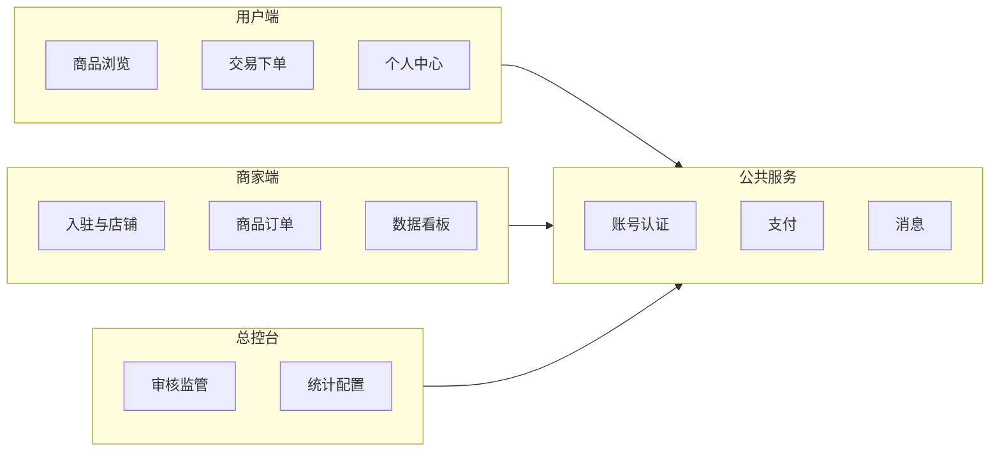

# PRD v0.1 — 多商户电商平台

> 状态：Phase 0 基线 | 版本：0.1 | 日期：2026-06-05

## 1. 产品目标

在约 15 周内交付可运行的 V1：完成「商家入驻 → 商品上架 → 用户下单支付 → 商家履约 → 平台监管」闭环，并具备店铺排行与基础数据统计。

## 2. 角色与终端

| 终端 | 角色 | 核心能力（V1） |
|------|------|----------------|
| 用户端 PC + H5 | 访客 / 买家 | 浏览、搜索、购物车、下单、订单跟踪、评价、热门店铺榜 |
| 商家端 PC | 注册商家 | 入驻申请、店铺与商品管理、订单处理、发货、简易数据看板 |
| 平台总控台 PC | 平台管理员 | 商家审核/冻结、用户管理、订单监管、商品违规审核、交易统计、权重配置 |

## 3. 模块边界

**V1 不包含**：优惠券、拼团、IM 客服、小程序、物流轨迹（见 Backlog）。

## 4. 核心用户故事（按 Phase）

### Phase 1 — MVP

1. 用户用手机号注册登录，浏览商品并加入购物车。
2. 商家提交入驻资料，管理员审核通过后开通商家后台。
3. 商家发布商品（SKU、库存、分类），用户端可搜索与查看。
4. 用户下单并使用**模拟支付**，订单进入待发货。
5. 商家填写物流单号发货，用户确认收货。
6. 管理员在总控台查看商家、用户、全平台订单。

### Phase 2 — 商业能力

7. 接入微信/支付宝真实支付（依赖商户号）。
8. 平台按规则计算店铺权重，展示热门店铺榜；商家/平台看板。

### Phase 3 — 体验

9. H5 体验优化；关注、收藏、评价；订单站内信/短信提醒。

## 5. 非功能需求

| 项 | V1 目标 |
|----|---------|
| 部署 | 单机 Docker，可扩展为多实例 |
| 安全 | 登录态校验、商家数据隔离、基础越权防护 |
| 性能 | 排行读 Redis；排行定时重算，非实时全表扫描 |
| 可用性 | 核心接口目标 99%（单机阶段） |

## 6. 业务规则（Phase 0 决策）

| 规则 | 默认值 | 文档 |
|------|--------|------|
| 平台抽佣 | 订单实付金额 5% | [ADR-002](decisions/ADR-002-commission-rate.md) |
| 支付策略 | Phase 1 模拟支付；Phase 2 真实支付 | [ADR-001](decisions/ADR-001-payment-strategy.md) |
| 商家入驻 | 需平台审核 | [platform-rules-draft](legal/platform-rules-draft.md) |

## 7. 验收标准（Phase 0）

- [x] PRD v0.1 本文档
- [x] ER 图与 DDL 草案
- [x] 本地 `docker compose up` 可启 MySQL + Redis
- [ ] 营业执照、域名、ECS、支付商户号（需业务侧完成，见 [CHECKLIST](phase0/CHECKLIST.md)）
