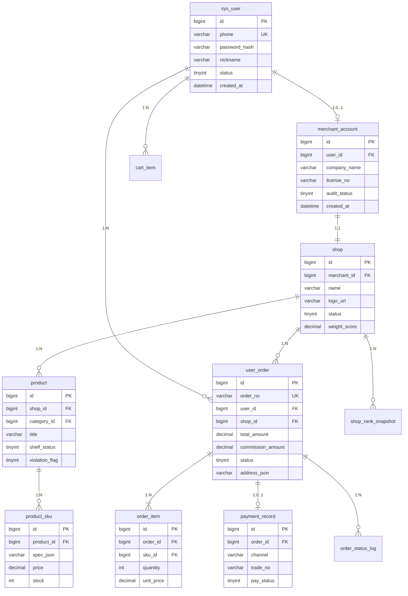

# 数据库 ER 说明（V1 草案）

## ER 图



## 表清单

| 表名 | 说明 | Phase |
|------|------|-------|
| `sys_user` | C 端用户 | 1 |
| `merchant_account` | 商家主体与审核 | 1 |
| `shop` | 店铺 | 1 |
| `product_category` | 商品类目树 | 1 |
| `product` | SPU | 1 |
| `product_sku` | SKU 库存价格 | 1 |
| `cart_item` | 购物车 | 1 |
| `user_order` | 订单主表 | 1 |
| `order_item` | 订单明细 | 1 |
| `order_status_log` | 状态流水 | 1 |
| `payment_record` | 支付记录 | 1（模拟）/ 2（真实） |
| `product_review` | 商品评价 | 3 |
| `user_favorite` | 收藏 | 3 |
| `user_shop_follow` | 店铺关注 | 3 |
| `shop_rank_snapshot` | 排行快照 | 2 |
| `platform_config` | 权重系数等 | 2 |
| `sys_message` | 站内信 | 3 |

DDL 见 [backend/sql/V1__init_schema.sql](../../backend/sql/V1__init_schema.sql)。

## 订单状态机

```
PENDING_PAY(10) → PAID(20) → SHIPPED(30) → COMPLETED(40)
                 ↘ CANCELLED(50)
```

Phase 1 模拟支付：创建订单后可直接调用「模拟支付成功」→ `PAID`。
